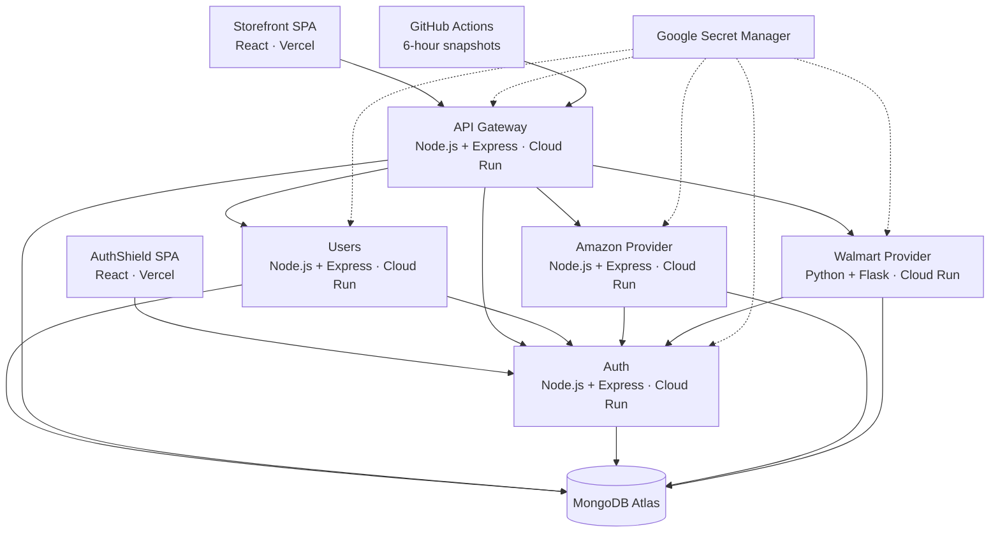

# Trendy Treasures

**A microservice e-commerce platform that aggregates products from independent providers, keeps provider credentials off the browser, and hands checkout to the provider that owns the transaction.**

[](https://ecommerce-test-qvvv.vercel.app) [](https://ecommerce-test-lemon-xi.vercel.app)     

**Live storefront → [ecommerce-test-qvvv.vercel.app](https://ecommerce-test-qvvv.vercel.app)**  
**AuthShield → [ecommerce-test-lemon-xi.vercel.app](https://ecommerce-test-lemon-xi.vercel.app)**

---

## What is Trendy Treasures?

Trendy Treasures is an e-commerce aggregator built as seven deployable pieces: two React SPAs, an API Gateway, Users and Auth services, and two simulated provider services for Amazon and Walmart.

Shoppers browse one catalog and keep one cart, while product data and checkout remain provider-owned. The gateway injects provider credentials server-side, refreshes them when needed, and routes requests without exposing those tokens to the browser.

The project is designed to demonstrate production-style service boundaries, authentication, secure checkout handoff, price tracking, AI-assisted product features, and cloud deployment across both Node.js and Python services.

## The Problem

A marketplace aggregator has to solve more than product display:

- provider credentials must never reach the browser
- one storefront has to talk to multiple provider APIs consistently
- expired provider tokens should refresh without interrupting the shopper
- checkout totals must come from trusted server-side product data
- shopper, admin and developer authentication need different trust boundaries
- price changes need history, alerts and scheduled checks
- services written in different languages still need one stable contract

Trendy Treasures keeps those concerns separated instead of putting everything into one application.

## Who It Is For

- **Shoppers** browsing products from multiple providers in one storefront
- **Admins** authorizing provider integrations and managing users
- **Developers** creating and rotating API credentials through AuthShield
- **Engineers and recruiters** reviewing a full-stack microservice system with security, payments, AI features and cloud deployment

## Live Demo

**Storefront → [ecommerce-test-qvvv.vercel.app](https://ecommerce-test-qvvv.vercel.app)**

**AuthShield → [ecommerce-test-lemon-xi.vercel.app](https://ecommerce-test-lemon-xi.vercel.app)**

Payments use **Stripe test mode**. Amazon and Walmart are simulated provider services built specifically for this project.

## Product Preview

The live deployment covers the complete flow:

- browse Amazon and Walmart products through one storefront
- create shopper or admin sessions, including Google sign-in
- add products to a guest or authenticated cart
- track prices and receive price-drop alerts
- ask product questions or request AI price advice
- hand checkout to the correct provider
- create, rotate and authorize provider credentials through AuthShield

## Core Features

### Storefront

- Unified Amazon and Walmart product catalog
- Shopper signup, login, Google OAuth and password recovery
- Guest cart that merges into the server cart after login
- Product details, price history and price alerts
- Admin dashboard and user management

### Provider integration

- API Gateway routes all storefront API traffic
- Provider JWTs are injected server-side and never exposed to the browser
- Expiring provider tokens refresh transparently through Auth
- Amazon is implemented in Node.js; Walmart uses Python/Flask with the same contract
- Provider tokens are scoped by API path and checked against the current active token ID

### Checkout

- Cart items are grouped by provider
- Users creates a short-lived checkout intent with no shopper PII
- The browser is handed to the provider's branded checkout page
- Stripe PaymentIntents are created from server-trusted item data
- Providers verify the payment before saving the order
- Successful checkout calls back to Users and removes purchased items from the cart

### Price tracking and AI

- Price snapshots are stored over time
- GitHub Actions checks tracked products every six hours
- Threshold crossings can trigger Brevo email alerts
- AI price advice uses recent price history
- Product Q&A is grounded in the selected product's metadata

### Developer credentials

- Separate AuthShield SPA for developer accounts
- Create, inspect, rotate and delete API credentials
- OAuth-style provider authorization flow
- Credential secrets are stored hashed; provider access tokens support revocation

## How Trendy Treasures Works

1. **The storefront calls the API Gateway.**
2. **The gateway routes the request** to Users, Amazon or Walmart.
3. **Provider requests get a server-side JWT** from the gateway's credential store.
4. **Near-expiry or rejected tokens refresh automatically** through Auth using an RS256-signed gateway assertion.
5. **Checkout creates a referral intent** and moves the browser to the correct provider.
6. **The provider recomputes the amount**, completes Stripe payment and confirms the order.
7. **Price snapshots and alerts continue in the background** through scheduled GitHub Actions checks.

## Architecture

The diagram below shows the current production architecture.



The gateway and Users share the storefront database because the gateway reads provider credentials, price snapshots and alerts. Auth, Amazon and Walmart keep their own databases.

## Technology Stack

| Area | Technology |
|---|---|
| Storefront | React 18, React Router, Tailwind CSS |
| AuthShield | React 18 |
| API Gateway | Node.js 20, Express, http-proxy-middleware |
| Users service | Node.js, Express, Mongoose |
| Auth service | Node.js, Express, EJS, JWT, Google OAuth |
| Amazon provider | Node.js, Express, Stripe |
| Walmart provider | Python 3.12, Flask, MongoEngine, Stripe |
| Database | MongoDB Atlas |
| AI | OpenAI `gpt-4o-mini` |
| Email | Brevo HTTPS API |
| Frontend hosting | Vercel |
| Backend hosting | Google Cloud Run |
| Secrets | Google Secret Manager |
| Build & registry | Cloud Build, Artifact Registry |
| Testing | Node test runner, Jest, Supertest, Python unittest |
| Automation | GitHub Actions |

## Engineering Highlights

- **Transparent provider-token refresh** — the gateway refreshes expiring tokens through Auth and retries the original provider request without exposing the refresh flow to the browser.
- **Single-flight refresh protection** — concurrent requests for the same provider share one in-flight refresh instead of creating a token-refresh stampede.
- **Asymmetric gateway trust** — the gateway signs refresh assertions with an RS256 private key; Auth stores only the matching public key.
- **Immediate provider-token revocation** — each provider JWT carries a `jti`; reauthorization rotates the active ID and superseded tokens are rejected.
- **Language-agnostic service contracts** — Amazon and Walmart implement the same provider API in Node.js and Python.
- **Server-authoritative payments** — providers recompute totals from trusted checkout intent data and verify Stripe payment state before persisting orders.
- **Portable client identity** — rate-limit identity works across local development, Cloud Run and the retained Render compatibility preset without trusting caller-spoofable headers.
- **Least-purpose runtime identities** — each Cloud Run service has its own service account and reads only the secrets it needs.

## AI and Search

AI is deliberately limited to features where it adds value rather than controlling the transaction path.

### Price advice

Recent price snapshots are summarized into deterministic statistics before the model sees them. The model explains whether the current price looks favorable; it does not calculate the underlying history itself.

### Product Q&A

Questions are answered from the selected product's metadata. Inputs are capped before they reach OpenAI, and the feature degrades cleanly when AI configuration is unavailable.

Product discovery itself remains provider-backed rather than relying on an AI search index.

## Real-Time and Background Processing

Trendy Treasures does not require WebSockets. Work that should not block a shopper is handled through scheduled or transparent background-style flows:

- **Price snapshots** — GitHub Actions calls the gateway every six hours for products with active alerts.
- **Price-drop notifications** — threshold evaluation can trigger Brevo email without changing the shopping flow.
- **Provider-token refresh** — refresh and retry happen behind the gateway, with a single-flight lock per provider.
- **Active-token checks** — Amazon and Walmart cache Auth introspection briefly so every catalog request does not require another network hop.

## Security and Data Protection

- **Separate auth domains** for shoppers/admins, developers and provider access tokens
- **HttpOnly, Secure cookies** in production
- **Double-submit CSRF protection** for authenticated browser actions
- **Strict CORS allowlists** for Vercel and Cloud Run origins
- **RS256 assertions** from Gateway → Auth
- **Shared internal-auth secret** on protected service-to-service callbacks
- **Hashed passwords and credential secrets**
- **Provider JWT path scoping** so one provider token cannot be reused against another API
- **Rate limits** on general, authentication and payment routes
- **SSRF checks** on developer redirect URIs
- **Google Secret Manager** for production secrets
- **Server-side Stripe amount verification**

No compliance certification is claimed. This is a portfolio system using Stripe test mode and simulated provider services.

## Production Deployment

| Piece | Where |
|---|---|
| Storefront | Vercel |
| AuthShield | Vercel |
| API Gateway | Google Cloud Run — Toronto |
| Users | Google Cloud Run — Toronto |
| Auth | Google Cloud Run — Toronto |
| Amazon | Google Cloud Run — Toronto |
| Walmart | Google Cloud Run — Toronto |
| Databases | MongoDB Atlas |
| Secrets | Google Secret Manager |
| Container builds | Cloud Build + Artifact Registry |
| Scheduled snapshots | GitHub Actions |

The current Cloud Run deployment uses one instance per backend while rate-limit counters, replay protection and several caches remain in memory.

Full runbook: **[CLOUD_RUN_DEPLOYMENT.md](CLOUD_RUN_DEPLOYMENT.md)**.

## Performance and Load Testing

No production load-test benchmark is claimed yet.

The current deployment is intentionally conservative:

- provider tokens are cached for short periods to reduce database reads
- active-token introspection is cached briefly at the provider layer
- AI price advice is cached for six hours per product
- each backend is capped at one Cloud Run instance while exact rate-limit and replay semantics are in memory

Horizontal scaling should come after those shared-state concerns move to Redis or another centralized store.

## Testing and Quality

Automated coverage currently focuses on the highest-risk infrastructure and authentication paths.

```bash
cd APIGateway && npm test
cd Auth/server && npm test
cd Walmart && python -m unittest discover
cd client && npm test
```

The suites cover provider-token refresh/retry behavior, proxy configuration, rate-limit identity, Auth signup/login/refresh flows, CSRF, OAuth state handling, token invalidation and Walmart client-identity behavior.

Users and Amazon still need fuller dedicated automated suites; that remains a known quality gap rather than being hidden behind a coverage claim.

## Repository Structure

```text
client/              Storefront and admin React SPA
APIGateway/          Public API gateway and provider-token orchestration
Users/               Shopper/admin, cart, checkout, price and AI domain
Auth/
├── client/           AuthShield developer SPA
└── server/           Developer accounts and provider credential service
Amazon/              Node.js provider implementation
Walmart/             Python/Flask provider implementation
docs/                Architecture, security, API and data-model documentation
docker-compose.yml   Local multi-service environment
CLOUD_RUN_DEPLOYMENT.md
```

## Getting Started

You need Node.js, Python, MongoDB, Stripe test keys, and the service-specific environment values documented in each `.env.example`.

```bash
git clone https://github.com/CHAITANYAGANDI/Trendy_Treasures.git
cd Trendy_Treasures

# configure each service from its .env.example
docker compose up --build
```

Then start the two SPAs:

```powershell
cd client
npm install
npm start

# separate terminal
cd Auth/client
npm install
npm start
```

Local defaults:

- Storefront: `http://localhost:3001`
- AuthShield: `http://localhost:3002`
- Gateway: `http://localhost:7000`
- Users: `http://localhost:7001`
- Auth: `http://localhost:5000`
- Amazon: `http://localhost:8000`
- Walmart: `http://localhost:8001`

Generate the Gateway/Auth RSA keypair with:

```bash
node genkeys.js
```

## Configuration

Each service's `.env.example` is the source of truth for local configuration.

Production secrets are not committed. Cloud Run reads sensitive values from Google Secret Manager, while Vercel stores the React build-time environment variables.

The cross-service trust relationships that must remain consistent are documented in **[CLOUD_RUN_DEPLOYMENT.md](CLOUD_RUN_DEPLOYMENT.md)**.

## Documentation

| Document | Covers |
|---|---|
| [CLOUD_RUN_DEPLOYMENT.md](CLOUD_RUN_DEPLOYMENT.md) | Production deployment and operational checks |
| [docs/ARCHITECTURE.md](docs/ARCHITECTURE.md) | Service boundaries and end-to-end flows |
| [docs/SECURITY.md](docs/SECURITY.md) | Threat model, controls and known gaps |
| [docs/API.md](docs/API.md) | Public and internal API reference |
| [docs/DATA_MODEL.md](docs/DATA_MODEL.md) | Collections, indexes and ownership |

## Engineering Decisions and Trade-offs

**Aggregator + provider handoff** — Trendy Treasures owns discovery and cart state, while providers own checkout and orders. That keeps provider payment logic outside the aggregator.

**Gateway-held provider credentials** — the browser never receives provider access tokens. The cost is more gateway responsibility, including refresh, caching and retry behavior.

**Node.js + Python providers** — the duplicated provider contract is intentional: it demonstrates that HTTP/JWT boundaries are independent of implementation language.

**Separate MongoDB ownership** — Auth, Amazon and Walmart own their data independently; Gateway and Users share only the storefront data that both need.

**Public Cloud Run services + application auth** — the first production deployment keeps services reachable while CORS, JWTs, internal secrets and rate limits protect application paths. Private/IAM-only service traffic is a future hardening step.

**One instance before shared state** — exact per-IP limits, replay protection and caches are more important than horizontal scaling for the current portfolio workload.

## Current Limitations

- Amazon and Walmart are simulated providers rather than real marketplace integrations.
- Stripe runs in test mode.
- Rate-limit counters, replay protection and several caches are per-instance.
- Cloud Run is intentionally capped at one instance per backend.
- Atlas currently uses public network connectivity rather than static private egress.
- Users and Amazon need broader automated test coverage.
- Releases are not fully automated end to end.

## How Trendy Treasures Can Be Improved

- **Redis-backed shared state** — move rate limits, replay protection and caches out of process, then scale Cloud Run horizontally.
- **Private service-to-service traffic** — add IAM-authenticated calls and private ingress where browser access is not required.
- **Restricted Atlas networking** — route Cloud Run through static egress and narrow the Atlas allowlist.
- **Broader automated testing** — add Users, Amazon and full checkout integration suites.
- **Edge protection and observability** — add Cloud Armor and centralized security/payment alerts.
- **Release automation** — automate Cloud Run and Vercel deployment verification after merges.

## Acknowledgements

Trendy Treasures was designed and developed with the assistance of AI development tools, including Claude and ChatGPT, for areas such as implementation, debugging, architecture review and documentation.

The project uses open-source frameworks and libraries that remain subject to their respective licenses. Amazon and Walmart are simulated provider implementations used only to demonstrate the architecture; no affiliation with those companies is claimed.
